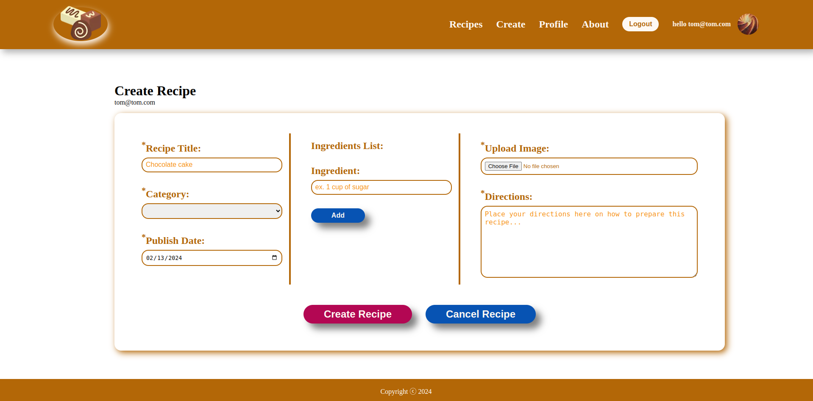

# Recipes App

The purpose of this app is to practice `Next.js`, `TypeScript` and `Firebase`, as well as configuring `Prettier`, using `Vanilla-Extract CSS`.

A user will be allowed to sing up, and after that to create a post, as well as to edit or delete this post. All posts will be listed on one page.  
<br/><br/>

---

### Content:

[1. Technical Details ](#technical-details)  
[2. Coding Guidelines](#coding-guidelines)  
[3. App Snapshots](#app-snapshots)

---

<br></br>

## 1. <a id="technical-details"></a> Technical Details

This is a **TypeScript-[Next.js](https://nextjs.org/)** project bootstrapped with [`create-next-app`](https://github.com/vercel/next.js/tree/canary/packages/create-next-app).

### **Operating System used**

- Linux Mint 21.2

### **Node version used**

- v18.18.0

### **Package manager used**

- [npm](https://www.npmjs.com/)

- v9.8.1

### **Check for dependencies**

- open `package.json` file

### **Install dependencies**

- open Terminal or Command Prompt
- change to working directory (where the file is located)
  ```bash
  cd /path/to/directory
  ```
- install dependencies

  ```bash
  npm install
  ```

  If [Volta](https://volta.sh/) is installed, it will pin [Node](https://nodejs.org/en) at the correct versions for the project folder.

### **Backend**

- Firebase - [add Firebase to an app](https://firebase.google.com/docs/web/setup)
- see also: [NOTES-Firebase.md](/NOTES-Firebase.md)

### .env

- Rename the `.env.example` to `.env.local` and replace with your data.
- Store `.env.local` file in the **root directory** of your project and `.gitignore` it.
- See the documentation related to [Environment Variables](https://nextjs.org/docs/app/building-your-application/configuring/environment-variables)

### Run the development server

```bash
npm run dev
```

open a Browser and enter `localhost:3000`
<br/><br/>

## 2. <a id="coding-guidelines"></a> Coding Guidelines <span><a href="#top"><small>🔝</small></a></span>

### **Coding Standards**

The project uses [ESLint](https://eslint.org/), [Prettier](https://prettier.io/docs/en/) and [Husky](https://www.npmjs.com/package/husky) to ensure consistency in coding.  
For details see: **[NOTES.md](NOTES.md)**
<br/><br/>

### **Styling and CSS**

[Vanilla-Extract CSS](https://vanilla-extract.style/)

naming stylesheets: `ComponentName.css.ts`
<br/><br/>

### **Documentation comments**

[@use JSDoc](https://jsdoc.app/)

<br></br>

## 3. <a id="app-snapshots"></a> App Snapshots <span><a href="#top"><small>🔝</small></a></span>





<span><a href="#top"><small>(Back to top)</small></a></span>
